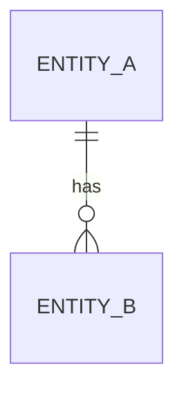

# Data Model — 【ĐIỀN: Tên feature 】

## Entities
【ĐIỀN: bảng/collection, field, kiểu, ràng buộc 】

## ER Diagram

## Thay đổi schema
- Migration: 【ĐIỀN — lưu ý đây là vùng HITL, cần con người duyệt 】
